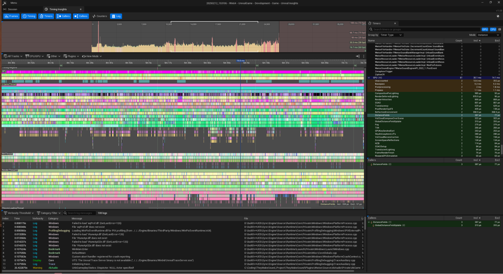
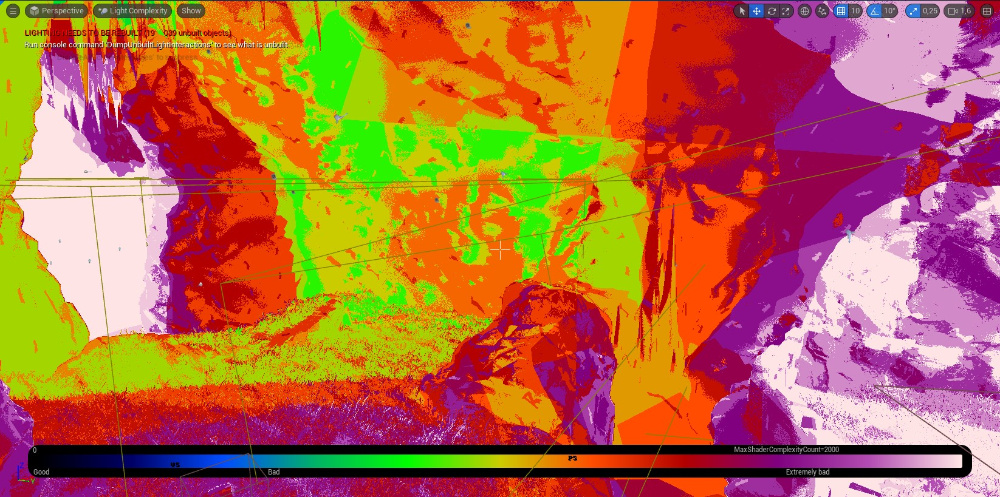
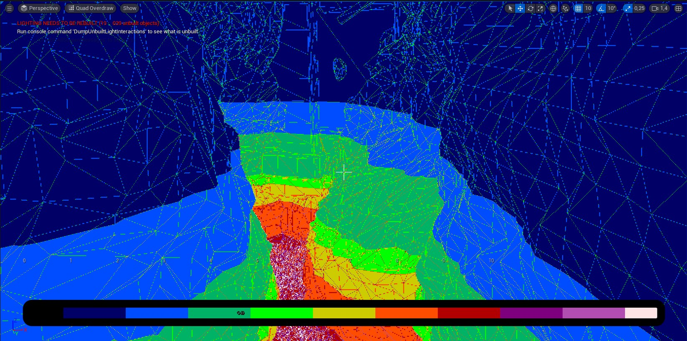
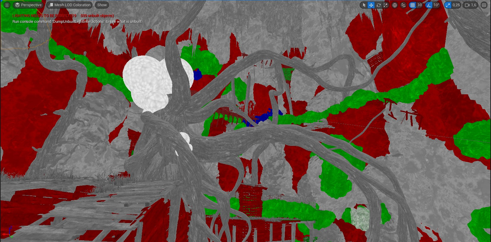
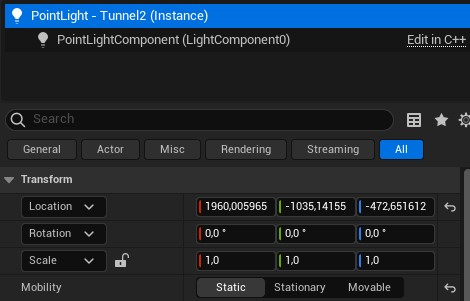
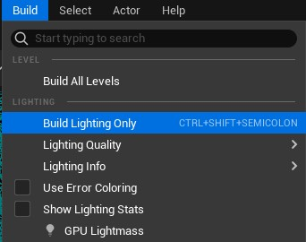
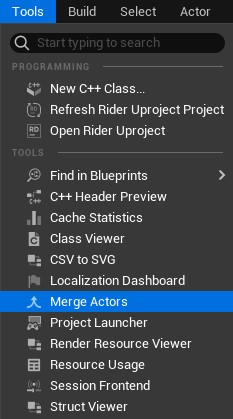
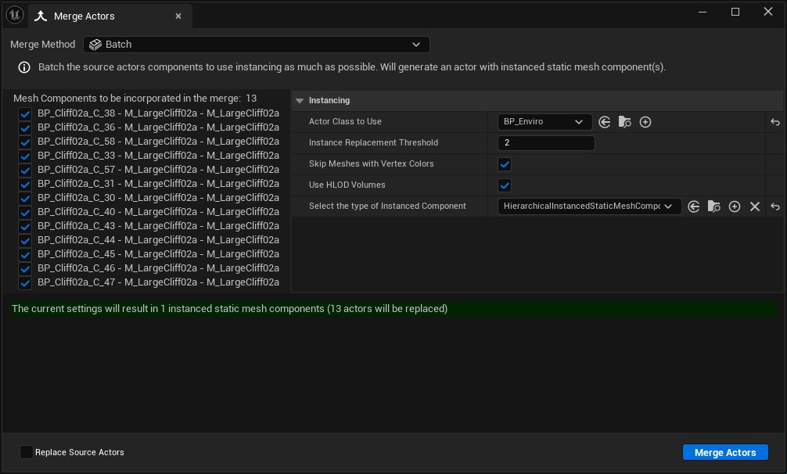
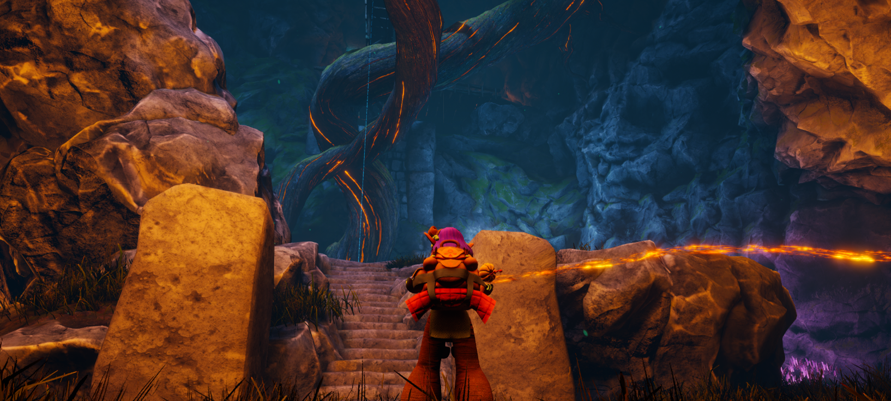
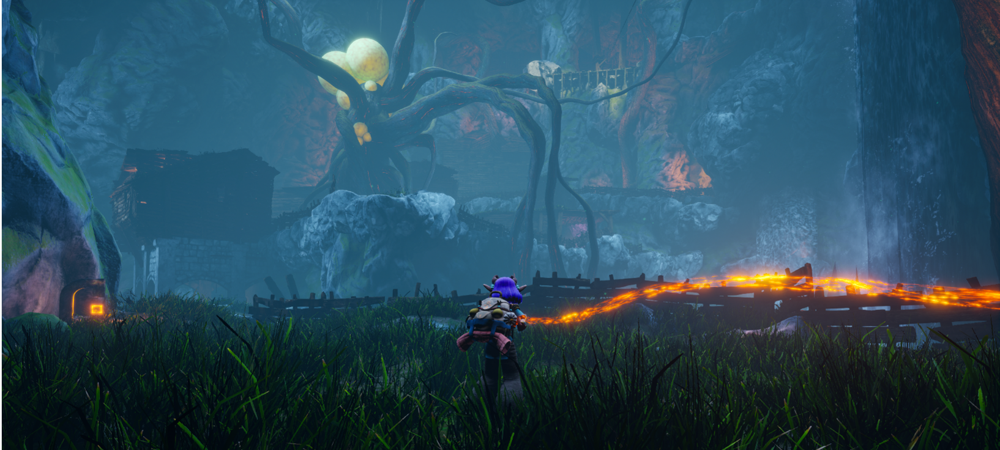

# Optimizations for the level art

> This work was done in collaboration with [Benjamin Philippot](https://www.artstation.com/benphi) as Level Artist and [Faer Souville](https://www.faersouville.com/) as Level Designer.

To make our game playable and enjoyable, we decided to dedicate part of our efforts on optimization. But since it was our first game on Unreal Engine, we had to form ourselves on how it works compared to others engines, what features it provides. Our game is an exploration game with a third person camera, this suppose bigger environment than games with a first person camera.

---
**Table Content**

- [Perforamance tracking](#performance-tracking)
- [Unreal features and technologies](#unreal-features-and-technologies)
- [What we done for They Make Sounds](#what-we-done-for-they-make-sounds)
- [Benchmark](#benchmark)

---

## Performance Tracking
At the beginning of the production, we had to determine what to track and how to track it. Since our game logic wasn't very stressful for the CPU, we conclude that the GPU was the bottleneck so we decided to put our efforts on:
- Reducing the **number of triangles** in the scene
- Reducing the **number of draw calls** of the GPU
- obtaining the best **compromise between quality and performance of lighting**

### Build regularly
For our project, we use Perforce as versioning system but we set up a Git repository for our builds and by making builds regularly we had the possibility to identify quickly performance issues.

### On Steam Deck ?
Our workstations were pretty solid with a CPU Intel Core i7 10700, a GPU NVidia RTX 3070, 32 GB RAM and working on SSD, it would have been difficult to observe significant framerate drops or expensive computation. To help us, we decided to use the Steam Deck as target platform because it is a much more limited hardware and it don't require any devkit nor different build setup because of Proton which allows Windows build to run on Steam Deck.

### Profiler
| [Unreal Insights](https://dev.epicgames.com/documentation/en-us/unreal-engine/unreal-insights-in-unreal-engine) | |
|-|-|
| Unreal provide a profiling tool  **Unreal Insights**, since it works by sending data through the network, actually it sends on localhost but we could use it on Steam Deck to and we were able to gather useful data to debug framerate drops. |  |

### Viewmodes 
Unreal Engine provides different viewmodes that give useful data like lit, unlit, wireframe,... Here some we used: 
| Viewmode | Description | Screenshot |
|-|-|-|
| **Light complexity** | Used to check dynamic lights. If light baking failed, it will be closer to white. |  |
| **Quad Overdraw** | Used to check pixels that are drawn many times. |  |
| **Mesh LODs Coloration** | This is useful for diagnosing any LOD issues or to see at which distance your LODs are switching. |  |

## Unreal features and technologies
Unreal Engine is a very dense engine with a lot features and parameters enabled by default regardless of if it is relevant or not. To discover what the engine is capable of, a certain amount of time was by reading documentation and watching conferences about Unreal. By doing so, with the help of our level artist, we decided on which feature to use for They Make Sounds. 

| **Features** ||
|-|-|
| **Occlusion culling** | By default it is enable which is great. |
| **Nanite** | Used for dynamic LODs is to expensive so we decided not to used it (*r.Nanite 0*) |
| **Lumen**  | Used for the global illumination, it has the same drawbacks of Nanite so we disable it to. |
| **Ray tracing**    | At some point through the development, we saw that ray tracing was active and take some milliseconds to performs, since we didn't use for anything we disable it. |
| **Baked lighting** | For the lighting, we decided to put static lights and to bake them to reduce GPU computation |
| **(Hierachical-)InstanceStaticMesh** | This feature helps reduce polycount and draw calls by merging multiple objects with the mesh and change them into instances that share all data except for their transform.  |
| **Distance culling** | Unreal provide Distance culling but we didn't use it for our project. |
| **Level Streaming**  | We could have used Level Streaming but since we didn't plan to use it since the beginning it was too late to put it in game. |

## What we done for They Make Sounds
### Problem presentation
Our level is 500m long, 300m wide and 300m high with some spots with high density in terms of meshes and lights. We were still testing our level, on Steam Deck and the game ran at 6 FPS at worse.

> To explain how we worked on that project, there were two versions of the level. The level artist's one and the technical programmer's one with optimizations.

Here the detail on what we did:

### The lighting
First, we decide to use static lights. 
1. To do so we put our lights to static

2. Then we build lights

> This action can take a long time, during the development we started the baking at the end of the afternoon and were making a build (*packing in Unreal language*) the next morning.

### Reduce mesh complexity
On an unfinished version of the level, we were at 14 millions polygons at some point of the development. We had some environmental meshes that had more than 10K polygons so we reduced their complexity. Just by doing this we drop at 8 millions polygons.

### Convert to Hierachical Instance Static Meshes
To drastically reduce polycount and draw calls, we used Hierachical Instance Static Meshes. To do so, we used the Merge Actors tool.

1. Select **Merge Method** to **Batch**
2. On the **Outliner**, select the static meshes you want to batch
3. Select the Actor class you want to use as template for the new actor created. *Since the tick update in blueprints has cost even empty ones, we created a template BP_Enviro with tick update disable*
4. Select the type of Instance Component to HierachicalInstanceStaticMeshComponent.

By doing this, we achieved 60 FPS on Steam Deck most of the time and we don't drop less 30 FPS.

## Benchmark
We are testing our build on two machines: the Steam Deck at first and a PC with a CPU Intel Core i7 10700, a GPU NVidia GeForce RTX3070 and 32 GB RAM.

### Average view
This is a regular view we can have in game. 

**Before**, we had 8K draw calls and 2 millions polygons.
| Platform | Frame rate | CPU time | GPU time | 
|-|-|-|-|
| Steam Deck | 20 FPS | 11 ms | 44 ms |
| PC         | 36 FPS | 6  ms | 25 ms |

**After**, we have have ~850 draw calls and ~435K polygons.
| Platform | Frame rate | CPU time | GPU time | 
|-|-|-|-|
| Steam Deck | 60 FPS | 10 ms | 15 ms |
| PC         | 36 FPS | 6  ms | 7  ms |

### High density view
This is one of the worst possible view we can have in game. 

**Before**, we had ~10K draw calls and ~5700K polygons.
| Platform | Frame rate | CPU time | GPU time | 
|-|-|-|-|
| Steam Deck | 6  FPS | 16 ms | 146 ms |
| PC         | 22 FPS | 5  ms | 42 ms |

**After**, we have have ~1675 draw calls and ~450K polygons.
| Platform | Frame rate | CPU time | GPU time | 
|-|-|-|-|
| Steam Deck | 26 FPS | 5 ms | 42 ms |
| PC         | 90 FPS | 5 ms | 7  ms |