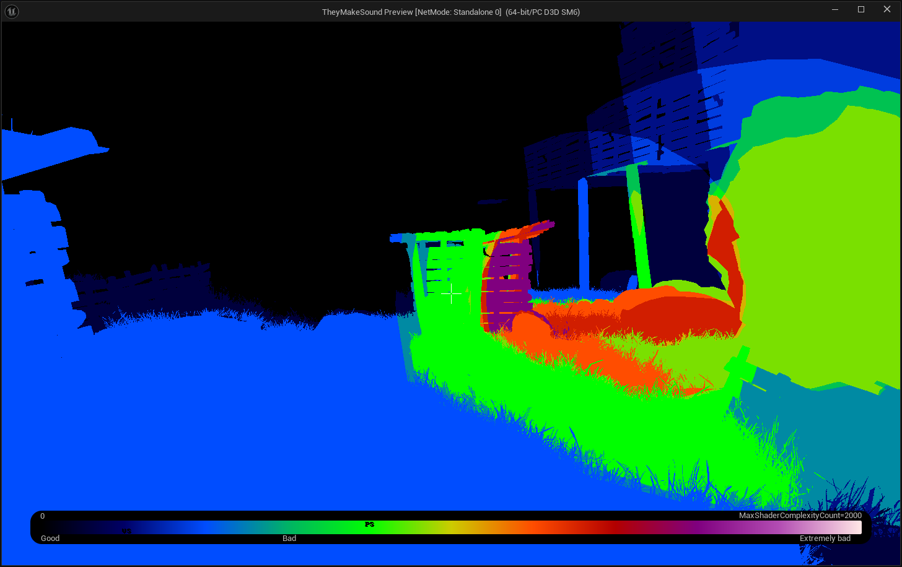
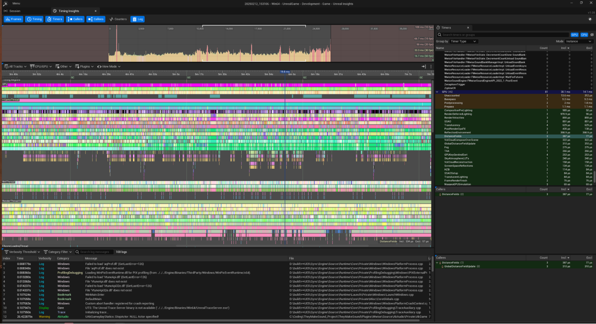

# **They Make Sounds - Performance Sheet**
> It is intended to put bounds and methods to author data and volumetry of assets.

---
## Table content
1. [Measurement](#measurement)
2. [Target Platforms](#target-platforms)
3. [Meshes](#meshes)
4. [Draw Calls](#draw-calls)
5. [Post Processing](#post-processing)
6. [Render Targets](#render-targets)
7. [Pixel Fill rates](#pixel-fill-rate)
8. [Lighting](#lighting)
9. [Audio](#audio)
10. [Policies](#policies)
---

## **Measurement**
### **Tools**

| Commands | |
|-|-|
| [Stat unit](https://unrealdirective.com/tips/stat-unit)                       | The **stat unit** command toggles the visibility of helpful performance metrics within the Unreal Engine viewport. Alternatively, the **stat unitgraph** console command can be used to display the same metrics along with a live graph of the metrics. |
| [Stat SceneRendering](https://unrealdirective.com/tips/stat-scenerendering)   | This tool is a great starting point to find the general areas of performance degradation. |
| [FreezeRendering](https://unrealdirective.com/tips/freeze-rendering)          | This allows you to easily inspect and debug the occlusion culling results. |

| Viewmodes | | |
|-|-|-|
| **Light Complexity** | Used to check dynamic lights. If light baking failed, it will be closer to white. |  |

*Others viewmodes: Mesh LOD Coloration, Wireframe, Quad Overdraw…*

### Profiling

| [Unreal Insights](https://dev.epicgames.com/documentation/en-us/unreal-engine/unreal-insights-in-unreal-engine) | |
|-|-|
| **Unreal Insights** is a telemetry capture and analysis suite that can capture events from your project at high data rates. Unreal Insights helps you identify areas of data that might require optimization. |  |

*See also [GPU Visualizer](https://unrealdirective.com/tips/gpu-visualizer)*

## **Target Platforms**
---

| Platform | CPU | Memory | GPU | Framerate
| - | - | - | - | - |
| PC Minimum | Intel Core i5 2300 *@ 2.8 GHz* | 8 GB | NVIDIA GTX 770 | **30** |
| PC Recommanded | Intel Core i7-10700 *@ 2.9 GHz* | 16 GB | NVIDIA GTX 1080 | **60** |
| Xbox Series | AMD Zen 2 *@ 3,8 Ghz (eq. AMD Ryzen 5 3600)* | 10GB GDDR6 *8GB at 224GB/s 2GB at 56GB/s* | AMD RDNA 2 20 CUs *@ 1.565 Ghz (eq. Radeon RX 6600 XT)* | **60** |
| PS5 | AMD Zen 2 *@ 3,5 Ghz (eq. AMD Ryzen 5 3600)* | 16 GB GDDR6 *at 448GB/s*| AMD RDNA 2 36 CUs *@ 2.23 Ghz (eq. RTX 2070)* | **60** |
| Steam Deck | AMD Zen 2 @ 2.4 - 3.5 Ghz | 16 GB LPDDR5 *at 6400MT/s* | AMD RDNA 2 8 CUs  *@ 1.6 Ghz (eq. GTX 1050 Ti)*  | **30** |
| Switch 2 | ARM Cortex-A78C | 12 GB | Nvidia T239 Ampere | **30** |

## **Meshes**
---
| Polycount in-game | |
| - | - |
| Expected  | 600K    |
| Average   | 1000K   |
| Maximum   | 2000K   |

| Assets | | |
| - | - | - |
| **Mesh Type** | **Polycount** | |
| **Main Character** | | |
| Body      | 35K   | |
| Artifacts | 2K    | Sonoscope, Zipline, Vertical line |
| **Environment** | | |
| Cliffs        | 12K | *Use [(Hierarchical-)InstantiateStaticMesh](https://docs.google.com/document/d/18cEoqdnP2etY9xswFMUB5a21_Gm-nlhdiVBnVlICZ1w/edit?tab=t.0#heading=h.dk6zyjg5jjdu)* |
| Props         | 1K  | *Pillar, rock, plank,...*   |
| Unique Assets | 25K | *Trees, building,...* |

## **Draw Calls**
---
At any moment, avoid more than **10K** Draw Calls. From nom, we are at **<2K** Draws Calls when optimized.
### Instantiate Static Meshes
Use [ISM](https://dev.epicgames.com/documentation/en-us/unreal-engine/instanced-static-mesh-component-in-unreal-engine) or [HISM](https://dev.epicgames.com/documentation/en-us/unreal-engine/instanced-static-mesh-component-in-unreal-engine#hierarchicalinstancedstaticmesh) 
to batch static meshes and reduce Draw Calls. After making the Level Art, use [Merge Actor](https://dev.epicgames.com/documentation/en-us/unreal-engine/merging-actors-in-unreal-engine) to create ISM or HISM and select *BP_Enviro* as ***Actor class to use***.

## **Post Processing**
---
Don’t use volumetric fog in the Post process, fogs are put in the level around lights. 
A **PostProcessVolume** is used for vignettes when the character is dying.

## **Render Targets**
---
Use native resolution, no particular render target has been selected.

| | |
| - | - |
| HD/QHD | **1920x1080** / **2540x1440** |
| Nintendo Switch / Steam Deck | **1280x720** / **1280x800** |

Use *ScreenSize X (X is in %)* command to change render target in Unreal to test visual aspects.

## **Pixel Fill Rate**
---
Avoid Quad overdraw *(Viewmode [Quad Overdraw](https://unrealartoptimization.github.io/book/profiling/view-modes/) in unreal)* by setup LODs.

## **Lighting**
---
Use **static lighting** for the level. 
**Dynamic lighting** are allowed for **entities** such as Character and Jellyfish. 
We disable **Ray Tracing** since it takes expensive GPU computation.

## **Audio**
---
### Asset Bugdeting
Our [asset list](https://docs.google.com/spreadsheets/d/14cdEGOf0bY5NV4Twlyq643eCHnlAqhnzGAAsVEJh_AY/edit?gid=0#gid=0) contains the type of sounds, 
if they’re in loop or not, and we try to track the weight of the “raw files” (.wav) in MB.

The quality we want asks us to be quite rigorous about their size in build, how they 
decompress and how much space they take in our CPU. 
We chose for the codec to have **three** main profiles for rendered audio.

| | | | |
|-|-|-|-|
| Ogg Vorbis High Q | Streamed      | 48kHz 24bits, 2-Channels Stereo                | Ambiences, longs sounds                    |
| WAV               | Not streamed  | between 24 to 32kHz, 16bits, 1 to 2 channels   | Sound effects, UI sounds, creatures/NPCs   |
| WAV               | Streamed      | 48kHz, 24bits, 2-Channels Stereo               | Character’s voicing, musics                |

That way it will allow us to limit **weight** and **manage CPU resources** wisely.

### Resource Management
There’s some tricks with a Wwise-Unreal Engine integration that can be done to avoid an overuse of the resources and save some CPU time and calls. 
We’re using Ak Multipositionning through an Actor Blueprint which will act like a manager to indicate which actors will have the sound posted on, and it will be posted **only once**.

## **Policies**
---

- Regarding **mesh authoring**, we will not use Nanite to match the target VRAM objective. (See [Mesh Guidelines](#meshes))

- Regarding **lighting authoring**, we will not use Lumen for global illumination instead we will use **static lights** in order to have **baked lights**, only entities (player, jellyfish,...) can have dynamic lights with reasonable amount (<10).