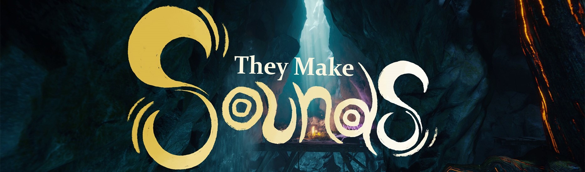
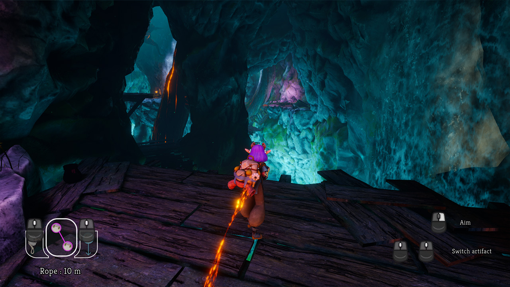
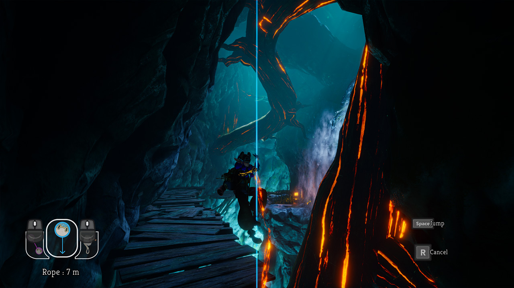
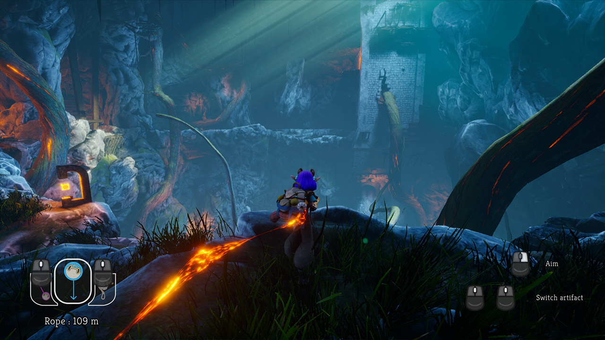

# 🎒 They Make Sounds 🎒

## Presentation
> Game created in 4.5 months as a project in the second year of the Master's degree at ENJMIN. It was made by 10 people.
 
**They Make Sounds** is a 3D exploration game where you play an **archaeologist** descending from the **gigantic abyss** to study the ruins of a mysterious civilization. Equipped with ancient artifacts, make your way even deeper into the abyss to unravel the secrets of this mysterious civilization and discover how their story relates to yours.

The goal of this project was to produce a **Vertical Slice** of potential bigger game with the aim of presenting it to a jury as if we were looking for funding.

## Screenshots
 
|||
|-|-|
|||
|||

## My work on this project
### Delivrables
As a school project, in programming we had deliverables to produce about technical aspects of our game. 

- [**Performance Sheet**](/PerformanceSheet/Performance_Sheet.md) : This sheet **indicate** volumetries of polygons, textures and shader weight of the game and the **eventual** limitation that ust be respected to ensure proper release.
- [**Technical Problem**](/TechnicalProblem/Technical_Problem.md) : a detailed **description** of a technical **problem** (and justification of the choice), a technical description of the various possible **solutions**. *It was required one for each programmer, you can consult Lucien Secord's document [here](https://github.com/Lyrdinn/TheyMakeSounds).*

### Techincal aspect

- [**Optimizations for the level art**](Optimizations/Optimizations.md) : for this project, I was in charge of the performance aspects and with our Level Artist we dedicated some time during the development to reduce GPU time computation. 

## School presentations

---

## Project Team

| Member  | Speciality  |
| ----- | - |
| 👔 [Florian Lecareux](https://www.lecareuxflorian.fr/)  | Producer                                          |
| 💻 [Théophile Carrasco](https://github.com/EyeCrown)    | Technical Programming                             |
| 💻 [Lucien Secord](https://github.com/Lyrdinn)          | Gameplay Programming                              |
| 🧠 [Margot Thetiot](https://margote.itch.io/)           | User Research & UX/UI Design                      |
| 🖌️ [Benjamin Philippot](https://benphi.artstation.com/) | 3D Environment & Level Art & Tech Art & Cinematic |
| 🖌️ [Brice Bonnefond](https://bryssbo.itch.io/)          | Concept Art & UI Art                              |
| 🖌️ [Anaïs Dubart](https://anaisd.artstation.com/)       | 3D Art & Character                                |
| 🎵 [Enzo Tittarelli Sanz-Crespo](https://kygen-sondidier.itch.io/)  | Game Audio Design                     |
| 🎲 [Faer Souville](https://faer.itch.io/)               | Tech & Level Design                               |
| 🎲 [Maxence Martiniani](https://dotsquare.itch.io/)     | System & Narrative Design                         |
| **Thanks to** |
| [Jules Quirin](https://cloudcastleaudio.itch.io/) | Music          |
| [Paul Coret](https://paul-coret.itch.io/)         | Sound Ambiance |
| [Emma-Louise Bot](https://malou76.itch.io/)       | Voice          |
