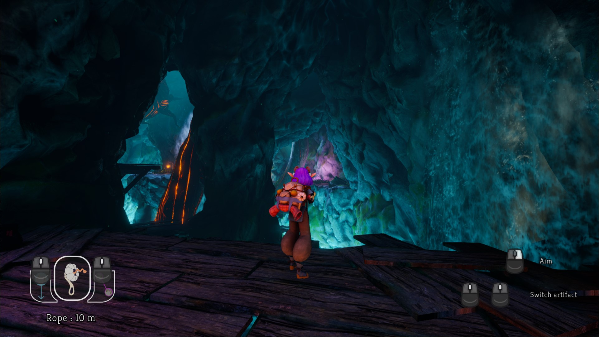
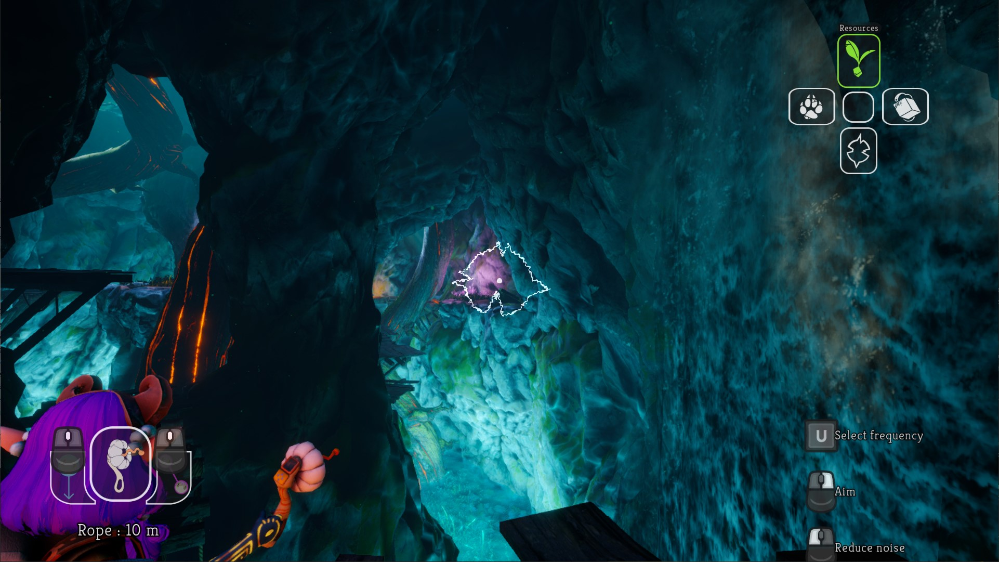
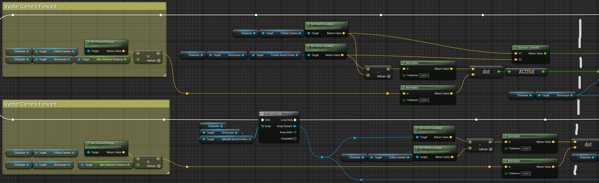
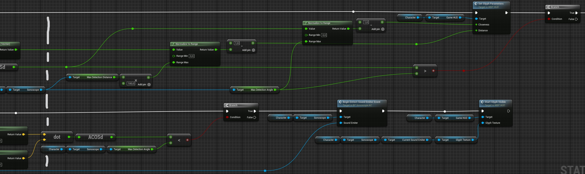

# **Sonoscope** - Technical Problem
## **Feature**

To help our character navigate through levels, she must use the **Sonoscope**, a tool that can detect sound emitter objects. Those can be *Resources* for Vertical Rope and Zipline, *Lifeforms* like Jellyfish, *Glyphs* to discover hidden elements in game and *Technology* for gameplay interactive elements. 

When she activates **Sonoscope**: 
- The camera gets closer to help aiming
- The UI Sonoscope frequency selector appears
- She can change Sonoscope frequency

Once the camera is pointing toward a detectable sound, the corresponding glyph appears at the center of the screen and its size, opacity and waviness are directed by how much the detection is accurate.

| Not Aiming State | Sonoscope Aiming State |
| - | - |
| |  |

## **Risk**
For this feature to work, at some point we need to compare with sound emitters if the character can detect them. This can create stress on the CPU because inelegant solutions like colliders or iterating over every object of the level every frame are expensive by moving over different addresses on RAM and can cause cache misses. Tensions appear around the way we grant access to sound emitters to **Sonoscope** at any time and how sounds are made detectable by the **Sonoscope**.

## **Solution**

### **Integration in engine**
Sonoscope in engine is an *Actor Component Blueprint* contained in Player Character Blueprint and some detection computation is handled by Player StateMachine. Mainly, it contains sound emitters references, maximum detection angle and distance and the current frequency to listen, it was made this way to isolate **Sonoscope** data.

### **How to detect sound emitters**
Since we have only one level and don't do any level streaming, at the start of the game, we generate a list containing all sound emitters of the level and store it inside the **Sonoscope** class. For it we use GetAllActorsOfClass node, it can be expensive but in our case we have less than one hundred sound emitters and it is only during the first frame. 

Once we have all sound emitters references in our **Sonoscope**, when character starts aiming we generate selected sound emitters list. So now, we can iterate on this list with less elements every frame with the least stress possible on CPU. Making that list requires to iterate on the all sound emitter list but this happend only when we start aiming and when we change the frequency of the **Sonoscope**.

When **Sonoscope** is active, each frame we iterate on the selected sound emitter list to determine if character can detect sounds. For our calculations we use the camera as reference for the character.
First, **Sonoscope** has a maximum detection range so we compute the distance between the camera and the sound emitter position. If it is close enough we can verify the alignement.

Next, to check the alignment we make the dot product between the camera forward vector and the camera-sound emitter vector to get the angle. If this angle is inferior than the maximum angle detection, it means we are detecting that sound emitter. This is when we do not detect a sound yet, once it is done we do the calculation but now check if it is superior to track when character stop aiming toward that sound emitter.

| Alignment check code | |
| - | - |
|  |  |
 